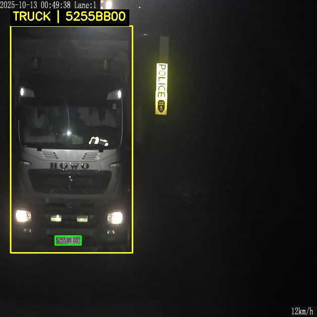
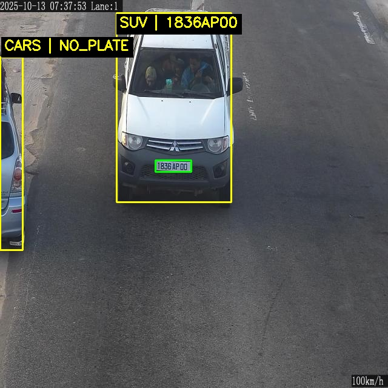
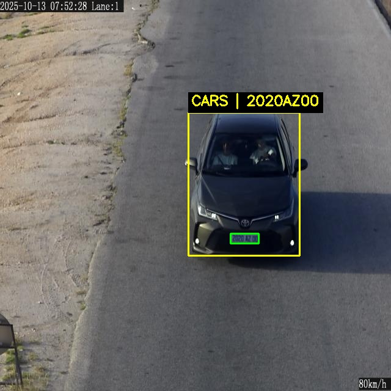

# Thesis Inference Pipeline

End-to-end Automatic License Plate Recognition (ALPR) and Vehicle Type Classification pipeline developed as part of the Bachelor Thesis:

"A Robust Deep Learning Pipeline for Joint Vehicle Type Classification and Automatic License Plate Recognition under Real-World Conditions"

## Features

Vehicle Type Detection (YOLOv8 ONNX)
License Plate Detection (YOLOv8 ONNX)
OCR Recognition
Plate-to-Vehicle Association
Real-Time Inference Pipeline
ONNX Runtime Deployment

## Supported vehicle classes:

BUS
CARS
MINIBUS
SUV
TRUCK
VAN

Final output format:

TRUCK | 1234AA06

## Example Results

### Truck Detection + ALPR


### SUV Detection + ALPR


### CAR Detection + ALPR


## Structure

```text
thesis_inference_pipeline/
├── models/
│   ├── vehicules.onnx
│   └── ALPR.onnx
├── data.yaml
├── yolo_utils.py
├── vehicle_detector.py
├── plate_detector.py
├── ocr_utils.py
├── pipeline.py
├── run.py
├── requirements.txt
└── README.md
```

## Installation
pip install -r requirements.txt


## Usage

Put test images in a folder, for example:

```text
test_images/
├── image1.jpg
└── image2.jpg
```

Run on a folder of images:

python run.py --source test_images --out-dir results --save-csv

Run on a single image:

python run.py --source image.jpg --out-dir results --save-csv

